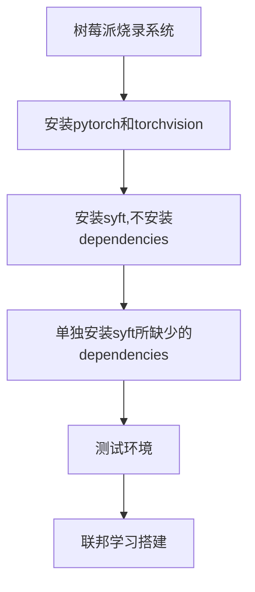
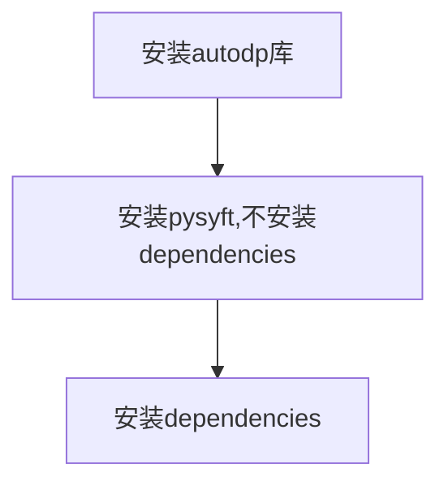

# 树莓派搭建联邦学习平台

# Record
2022/10/10：提出用两个树莓派去制作一个联邦学习的平台

2022/10/12：解决环境问题

2023/10/20：解决环境问题，请查看搭建3

# Experiments

## 参考实验信息
选取[联邦学习小系统搭建和测试（PySyft + Raspberry Pi 4） ](https://zhuanlan.zhihu.com/p/181733116)作为参考的demo。

这是2020年的一篇实验文章，很多东西版本都非常的老旧，如下所示。

|Harwared&Software|Information |
|--|--|
|2 Raspberry Pi 4B|4 cores arm A72, 8G RAM  |
|Raspberry Pi OS  | 32 bit |
| Python | version:3.7 |
| Pytorch | version:1.4.0 |
| Torchvision | version:0.5.0 |
|Pysyft | version:0.2.4|

实验步骤

## 具体实验-环境搭建

因为在每一个地方基本上都踩过一些坑，并且也有一些经验。就按照上述步骤一步步展开：

###  Part1 系统选择
使用的是树莓派的官方镜像源，会使用最新支持版本的Python。

在10/10当天烧录的时候，树莓派的Python版本还是3.9。

当10/11即第二天晚上烧录的时候树莓派的版本居然更新了，版本为3.11。

这里面有一个很大的麻烦，后续也会提及，就是Python版本超过了树莓派上所支持的torch和torchvision的版本（最多只到了3.10）。

目前想的是两个解决方案：

	1. 选择旧版本的树莓派镜像文件进行烧录
	2. 在树莓派上对Python进行降级

关于方案2对Python进行降级，也产生过问题：

	1. 删除python3.9，命令行输入python时，运行的python仍然为3.9
	2. 新安装的python3.7在解压以后无法使用

### Part2 torch 和 torchvision

很好的参考文章：[树莓派安装pytorch](https://zhuanlan.zhihu.com/p/446627852)

下载地址：[树莓派64位安装wheel文件合集](https://torch.kmtea.eu/whl/stable.html)

版本查看：[torch和torchvison版本匹配](https://github.com/pytorch/vision#installation)

作为我们最主要目标的pysyft的dependencies，这两个库的选择及其重要。

要做到 **python/torch/torchvison/syft**四个库的版本相对应。

目标实验的所有版本都很低，所以我使用了默认的3.9。

并且在实验中还遇到了一个问题：

	在官方的文档中torch1.11.0和torchvision0.12.0是正确匹配的；
	但是在我搭配这两个库使用的时候，import torchvison是失败的。

解决方案：

	使用torch1.11.0搭配torchvision0.10.0；
	此时两个库都能正常使用，但是不知道对后续syft有没有影响。

### Part3 syft

syft： [OpenMined/PySyft: (github.com)](https://github.com/OpenMined/PySyft)

Python查看dependencies的方式： [查看python第三方库的依赖](https://blog.csdn.net/qq_38316655/article/details/127943606?ops_request_misc=%257B%2522request%255Fid%2522%253A%2522169703879816800211543388%2522%252C%2522scm%2522%253A%252220140713.130102334.pc%255Fall.%2522%257D&request_id=169703879816800211543388&biz_id=0&utm_medium=distribute.pc_search_result.none-task-blog-2~all~first_rank_ecpm_v1~rank_v31_ecpm-4-127943606-null-null.142^v96^pc_search_result_base5&utm_term=%E5%A6%82%E4%BD%95%E6%9F%A5%E7%9C%8Bpython%E5%BA%93%E7%9A%84%E4%BE%9D%E8%B5%96%E5%85%B3%E7%B3%BB&spm=1018.2226.3001.4187)

清华大学镜像源：

	https://pypi.tuna.tsinghua.edu.cn/simple

这个可以说是非常折磨的一步。

在使用指令`pip install syft --no-dependencies `指令的时候安装有时候可能会比较慢，可以采用国内的镜像源，这样速度就会比较快。

同样也可以指定我们所需要的版本，采用以下指令：

	pip3 install syft==0.2.4 --no-dependencies

安装syft的时候出现最麻烦的问题就是

	1. 当前已有的package存在矛盾；
	2. 官方网站上没有找到每个版本所对应需要的packages或者requirements.txt。

解决方案：

	在Windows上安装不同版本的pysyft，使用pipdeptree查看其所需要的dependencies。

## 具体实验-环境搭建2-syft 0.6.0

在本部分成功将环境搭建成功，成功在两块树莓派、Windows笔记本上搭建安装pysyft。

### 具体信息

|Harwared&Software|Information |
|--|--|
|2 Raspberry Pi 4B|arm A72  |
|Raspberry Pi OS  | 64 bit |
| Python | version:3.9.2 |
|Pysyft | version:0.6.0|

### Part1 树莓派
树莓派系统文件：[链接](https://pan.baidu.com/s/1ie7FfhOXxviWDajhsm63sg?pwd=97tp)

烧录软件：balenaetcher

首先，在烧录系统的时候一定要选择Python版本为3.9.2的镜像系统；最新的树莓派系统Python版本为3.11，版本过高，无法正常安装pysyft。

这里有一个小细节，就是安装完成以后新建一个`.txt`文件，将其改为`ssh`文件，这样树莓派就不需要链接显示器打开`ssh`接口了。

系统烧录完成以后，直接使用pip指令安装即可，默认安装0.6.0版本的pysyft。指令如下：

	pip install syft -i https://pypi.tuna.tsinghua.edu.cn/simple

安装完成以后进行测试：

	python -c 'import torch, syft'

如果没什么问题，那树莓派这边就万事大吉了。

### Part1.5 树莓派附加问题

更新以后的树莓派可以建立多个环境了，但是还是存在一些问题。

建立多个环境教程：[Raspberry Pi Documentation - Raspberry Pi OS](https://www.raspberrypi.com/documentation/computers/os.html#about-python-virtual-enivronments)

CSDN 教程：[树莓派 python3.9降级为python3.7_python降级到3.7_](https://blog.csdn.net/ChenWenHaoHaoHao/article/details/131361776?ops_request_misc=%257B%2522request%255Fid%2522%253A%2522169712588516800226538028%2522%252C%2522scm%2522%253A%252220140713.130102334.pc%255Fall.%2522%257D&request_id=169712588516800226538028&biz_id=0&utm_medium=distribute.pc_search_result.none-task-blog-2~all~first_rank_ecpm_v1~rank_v31_ecpm-2-131361776-null-null.142^v96^pc_search_result_base5&utm_term=%E6%A0%91%E8%8E%93%E6%B4%BEwget%E4%B8%8B%E8%BD%BDpython%E8%A7%A3%E9%87%8A%E5%99%A8&spm=1018.2226.3001.4187)

同样可以以不同的python版本建立环境，具体步骤如下：

python下载网址：[Index of /ftp/python/](https://www.python.org/ftp/python/)

下载所需版本的python：

	waget https://www.python.org/ftp/python/3.9.2/Python-3.9.2.tgz
	tar zxvf Python-3.9.2.tgz

然后是编译

	cd Python-3.9.2
	./configure
	make
	sudo make install

创建虚拟环境

	python3.9 -m venv myenv

激活虚拟环境

	source myenv/bin/activate

### Part2 windows

windows在安装pysyft的时候很容易出现错误。

autodp：[yuxiangw/autodp: autodp(github.com)](https://github.com/yuxiangw/autodp)

原因是pysyft其中一个依赖autodp存在字符上的冲突，我所采用的解决办法如下：

第一步：安装autodp，我选用的方式是使用github中的setup文件进行安装。选择一个文件夹，执行以下指令：

	git clone https://github.com/yuxiangw/autodp.git

删除或者注释setup中的语句：

	with open("README.md", 'r') as f: 
		long_description = f.read()

然后在setup所在的文件夹下，运行指令安装即可：

	pip install -e .

第二步：独立安装pysyft，运行下面的指令

	pip install syft==0.6.0 --no-deps -i https://pypi.tuna.tsinghua.edu.cn/simple
	
第三步：安装所需要的dependencies。
打开pysyft==0.6.0的[github网址](https://github.com/OpenMined/PySyft/tree/0.6.0)寻找所[需要的库](https://github.com/OpenMined/PySyft/blob/0.6.0/packages/syft/setup.cfg)。

如下所示（已去除autodp==0.2）：

	scii_magic==1.6
    werkzeug==2.0.2
    bcrypt==3.2.0
    cachetools==4.2.4
    forbiddenfruit==0.1.4
    loguru==0.5.3
    names==0.3.0
    packaging==21.2
    pandas==1.3.4
    protobuf==3.19.1
    pyarrow==6.0.0
    pydantic[email]==1.8.2
    PyJWT==2.3.0
    PyNaCl==1.5.0
    pymbolic==2021.1
    sympy==1.9
    requests==2.26.0
    requests_toolbelt==0.9.1
    typing_extensions==4.0.0 # backport to older python 3
    SQLAlchemy==1.4.27
    numpy>=1.21.5
    importlib_metadata==4.8.2
    torch>=1.8.1,<=1.10.0
    gevent==21.8.0
    tqdm==4.62.3

将下文复制并制作成一个requirements.txt文件，并使用pip安装

	pip install -r requirements.txt

最后再进行测试：

	python -c 'import torch, syft'

大功告成。

## 具体实验-环境搭建3-syft 0.2.4
下载链接：[torch和torchvision安装wheel文件](https://download.pytorch.org/whl/torch_stable.html)

在Windows上环境配置成功，记录一下实验环境。

|Harwared&Software|Information |
|--|--|
| Python | version:3.7 |
| Pytorch | version:1.4.0 |
| Torchvision | version:0.5.0 |
|Pysyft | version:0.2.4|

在树莓派上的环境配置，实验环境如下

|Harwared&Software|Information |
|--|--|
| Python | version:3.7 |
| Pytorch | version:1.4.0 |
| Torchvision | version:0.5.0 |
|Pysyft | version:0.2.4|

### Part1 torch and torchvison

首先在conda中安装torch和torchvision的wheel文件，使用如下指令进行安装：

	pip install torch-1.4.0+cpu-cp37-cp37m-win_amd64.whl
	pip install torchvision-0.5.0+cpu-cp37-cp37m-win_amd64.whl

这样完成torch和torchvision的安装。

可以使用指令：

	python -c 'import torch, torchvision'

对安装的进行测试。

###  Part2 pysyft

安装不带有依赖的pysyft库：

	pip install syft==0.2.4 --no-dependencies -i https://pypi.tuna.tsinghua.edu.cn/simple 

再安装依赖：

	pip3 install lz4~=3.0.2 msgpack~=1.0.0 phe~=1.4.0 scipy~=1.4.1 syft-proto~=0.2.5.a1 tblib~=1.6.0 websocket-client~=0.57.0 websockets~=8.1.0 zstd~=1.4.4.0 Flask~=1.1.1 tornado==4.5.3 flask-socketio~=4.2.1 lz4~=3.0.2 Pillow~=6.2.2 requests~=2.22.0 numpy~=1.18.1  -i https://pypi.tuna.tsinghua.edu.cn/simple 

可以使用指令：

	python -c 'import torch, torchvision, syft'

对安装的进行测试。

期间遇到zstd安装在Windows上时出现

	error: Microsoft Visual C++ 14.0 or greater is required. Get it with "Microsoft C++ Build Tools": https://visualstudio.microsoft.com/visual-cpp-build-tools/ 

解决办法：[How to solve "error: Microsoft Visual C++ 14.0 or greater is required" when installing Python packages? ](https://stackoverflow.com/questions/64261546/how-to-solve-error-microsoft-visual-c-14-0-or-greater-is-required-when-inst)

### Part3 树莓派配置环境
树莓派安装conda教程：[树莓派上如何安装anaconda/miniconda环境配置](https://blog.csdn.net/weixin_39589455/article/details/128620393?spm=1001.2014.3001.5506)
树莓派pytorch安装地址：[树莓派64位安装wheel文件合集](https://torch.kmtea.eu/whl/stable.html)

首先，由于面对不同的树莓派上，可能有不同的python版本，因此我给出的解决办法是使用conda；选择python版本为3.7的conda。

获取树莓派的sh文件的指令

	wget https://repo.anaconda.com/miniconda/Miniconda3-py37_4.9.2-Linux-aarch64.sh

然后对miniconda进行安装

	bash Miniconda3-py37_4.9.2-Linux-aarch64.sh

添加.bashrc配置

	vim  ~/.bashrc
	export PATH="/home/pi/miniconda3/bin:$PATH" # 在vim中添加
	source ~/.bashrc

安装完成以后使用指令，查看python版本

	python

之后使用指令安装torch：

	pip install torch-1.4.0-cp37-cp37m-linux_aarch64.whl -i https://pypi.tuna.tsinghua.edu.cn/simple 

安装torchvision：
	
	

若直接运行`import torch`会报错

	>>> import torch
	Traceback (most recent call last):
	  File "<stdin>", line 1, in <module>
	  File "/home/pi/miniconda3/lib/python3.7/site-packages/torch/__init__.py", line 81, in <module>
	    from torch._C import *
	ImportError: libpython3.7m.so.1.0: cannot open shared object file: No such file or directory

解决办法是也是添加.bashrc配置

	vim  ~/.bashrc
	export LD_LIBRARY_PATH="/home/pi/miniconda3/lib" # 在vim中添加
	source ~/.bashrc

然后运行测试指令，没有问题的话torch和torchvision就安装完成。

解下来就是安装pysyft，首先是独立安装不安装依赖：

	pip install syft==0.2.4  --no-dependencies  -i https://pypi.tuna.tsinghua.edu.cn/simple 

然后安装依赖（由于在树莓派上安装scipy1.4.1和numpy1.18.1总是出现问题，于是我上调了版本但是发现也可以跑通，属于是走的歪路子；也可以通过wheel文件进行安装）：

	pip3 install lz4~=3.0.2 msgpack~=1.0.0 phe~=1.4.0 scipy~=1.5.1 syft-proto~=0.2.5.a1 tblib~=1.6.0 websocket-client~=0.57.0 websockets~=8.1.0 zstd~=1.4.4.0 Flask~=1.1.1 tornado==4.5.3 flask-socketio~=4.2.1 lz4~=3.0.2 Pillow~=6.2.2 requests~=2.22.0 numpy~=1.20.1  -i https://pypi.tuna.tsinghua.edu.cn/simple 

所有安装包安装完成以后会出现一个问题，就是`protobuf`这个库的版本不适配

	TypeError: Descriptors cannot not be created directly.
	If this call came from a _pb2.py file, your generated code is out of date and must be regenerated with protoc >= 3.19.0.
	If you cannot immediately regenerate your protos, some other possible workarounds are:
	 1. Downgrade the protobuf package to 3.20.x or lower.
	 2. Set PROTOCOL_BUFFERS_PYTHON_IMPLEMENTATION=python (but this will use pure-Python parsing and will be much slower).

那么就通过命令改装一下版本，问题就可以解决：

	pip install protobuf==3.20.0 -i https://pypi.tuna.tsinghua.edu.cn/simple

之后还会出现一个新的问题，就是

	import msgpack as msgpack_lib
	ModuleNotFoundError: No module named 'msgpack'

解决办法是：

	pip install msgpack -i https://pypi.tuna.tsinghua.edu.cn/simple

之后会出现报错

	ERROR: pip's dependency resolver does not currently take into account all the packages that are installed. This behaviour is the source of the following dependency conflicts.
	syft 0.2.4 requires flask-socketio~=4.2.1, which is not installed.
	syft 0.2.4 requires lz4~=3.0.2, which is not installed.
	syft 0.2.4 requires phe~=1.4.0, which is not installed.
	syft 0.2.4 requires numpy~=1.18.1, but you have numpy 1.20.3 which is incompatible.
	syft 0.2.4 requires Pillow~=6.2.2, but you have pillow 9.5.0 which is incompatible.
	syft 0.2.4 requires scipy~=1.4.1, but you have scipy 1.5.4 which is incompatible.

那么就安装没有安装的：

	pip install lz4~=3.0.2 phe~=1.4.0 -i https://pypi.tuna.tsinghua.edu.cn/simple 

最终仍然会出现错误，但是不影响我们代码的运行，使用一下代码进行测试

	import syft
	
<!--stackedit_data:
eyJoaXN0b3J5IjpbLTExMDIxMDE1ODcsLTcwOTU4NDk2MywtOD
A3NjM0MTUsLTE1MTE0MDQ4MDgsLTExNzM0MjYyMDAsMTU5ODY1
MzExMywtODc4NTcxNjE0LDQ3NzcyNjA1MSwtMTkxODM0NjMzOC
wzODA1MDc2ODMsLTIwMTI0MjA0OTBdfQ==
-->