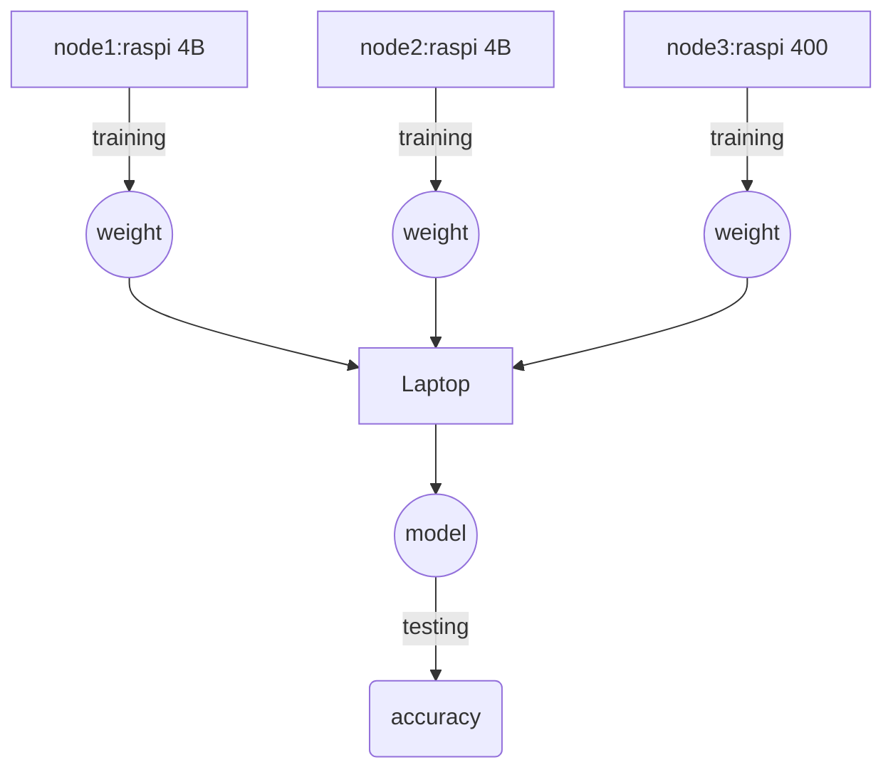

# 实验记录

## 2023-10-14 record
目前已经在Laptop（windows）、两个RasPi上安装了同样的环境

## 2023-10-17 test
打开指定文件夹：
	
	cd E:\2023mem\Python-PJ\pysyft\Pysyft-0.2.4\examples\tutorials\advanced\websockets-example-MNIST-parallel

运行测试指令

	python run_websocket_server.py --host '192.168.3.30' --port 8777 --id alice
	python run_websocket_server.py --host '192.168.3.30' --port 8778 --id bob
	python run_websocket_server.py --host '192.168.3.30' --port 8779 --id testing --testing

## 2023-10-23 test

在本次的测试中，成功调通了Windows和三个Raspi的联邦学习训练方式。

Windows打开指定文件夹

	cd E:\2023mem\Python-PJ\pysyft\Pysyft-0.2.4\examples\tutorials\advanced\websockets-example-MNIST-parallel

Raspi打开指定文件夹

	cd /home/pi/work/fl-pj/Pysyft-0.2.4/examples/tutorials/advanced/websockets-example-MNIST-parallel

### Raspi运行

node1: 192.168.3.33
	
	python run_websocket_server.py --host '192.168.3.33' --port 8777 --id alice
	
node2: 192.168.3.34

	python run_websocket_server.py --host '192.168.3.34' --port 8778 --id bob

node3: 192.168.3.38
	
	python run_websocket_server.py --host '192.168.3.38' --port 8779 --id charlie

### windows运行

	python run_websocket_server.py --host '192.168.3.30' --port 8780 --id testing --testing

### Jupyter Notebook
首先运行代码

	jupyter notebook

修改`in[7]`中代码
	  
	kwargs_websocket = {"host": "192.168.3.33", "hook": hook, "verbose": args.verbose}  
	alice = WebsocketClientWorker(id="alice", port=8777, **kwargs_websocket) 
	
	kwargs_websocket = {"host": "192.168.3.34", "hook": hook, "verbose": args.verbose}  
	bob = WebsocketClientWorker(id="bob", port=8778, **kwargs_websocket)
	
	kwargs_websocket = {"host": "192.168.3.38", "hook": hook, "verbose": args.verbose} 
	charlie = WebsocketClientWorker(id="charlie", port=8779, **kwargs_websocket)

	kwargs_websocket = {"host": "192.168.3.30", "hook": hook, "verbose": args.verbose} 
	testing = WebsocketClientWorker(id="testing", port=8780, **kwargs_websocket)

	worker_instances = [alice, bob, charlie ]

### 实验示意图

## 2023-10-30 test

在目前的华为路由器上一共连接了10台树莓派；

ip地址如下
	
	1	192.168.3.33
	2	192.168.3.40
	3	192.168.3.41
	4	192.168.3.42
	5	192.168.3.43
	6	192.168.3.44
	7	192.168.3.45
	8	192.168.3.46
	9	192.168.3.47
	10	192.168.3.48

运行指令如下：

	cd /home/pi/work/fl-pj/fl-demo; python run_websocket_server.py --host '192.168.3.33' --port 929 --id A
	cd /home/pi/work/fl-pj/fl-demo; python run_websocket_server.py --host '192.168.3.38' --port 929 --id B
	cd /home/pi/work/fl-pj/fl-demo; python run_websocket_server.py --host '192.168.3.40' --port 929 --id C
	cd /home/pi/work/fl-pj/fl-demo; python run_websocket_server.py --host '192.168.3.41' --port 929 --id D
	cd /home/pi/work/fl-pj/fl-demo; python run_websocket_server.py --host '192.168.3.42' --port 929 --id E
	cd /home/pi/work/fl-pj/fl-demo; python run_websocket_server.py --host '192.168.3.43' --port 929 --id F
	cd /home/pi/work/fl-pj/fl-demo; python run_websocket_server.py --host '192.168.3.44' --port 929 --id G
	cd /home/pi/work/fl-pj/fl-demo; python run_websocket_server.py --host '192.168.3.45' --port 929 --id H
	cd /home/pi/work/fl-pj/fl-demo; python run_websocket_server.py --host '192.168.3.46' --port 929 --id I
	cd /home/pi/work/fl-pj/fl-demo; python run_websocket_server.py --host '192.168.3.47' --port 929 --id J
<!--stackedit_data:
eyJoaXN0b3J5IjpbLTI1NDU0MDkyNSwxMTMxMDQ1MTUzLDc5ND
U4NzM4NywtMjE2Mzk1ODczLC0xMzE5ODQ0Nzg1LC0yNzY3MTA2
OTgsMTQ2MzY2MzY5MywxNDYyMDI5NDM4LDEyMTIwMTg0MjQsMT
kzOTUzMjgxMCwxMTQ3MjE2MDE0LC0xMjI1ODMzMzM3LDEwMzk5
MDA2OTUsLTEzMzUyNzMwNDksNzI0NzE5OTMsLTU3NjM4MjQwOC
wtMTc4MTY2MDY0N119
-->