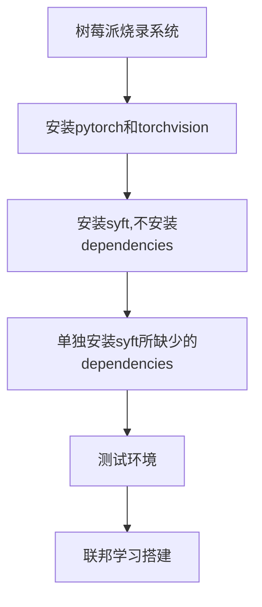

# 树莓派搭建联邦学习平台

# Record
2022/10/11：提出用两个树莓派去制作一个联邦学习的平台

# Experiments

## 参考实验信息
选取[联邦学习小系统搭建和测试（PySyft + Raspberry Pi 4） ](https://zhuanlan.zhihu.com/p/181733116)作为参考的demo。
这是2020年的一篇实验文章，很多东西版本都非常的老旧，如下所示。

|Harwared&Software|Information |
|--|--|
|2 Raspberry Pi 4B|4 cores arm A72, 8G RAM  |
|Raspberry Pi OS  | 32 bit |
| Python | version:3.7 |
| Pytorch | version:1.4.0 |
| Torchvision | version:0.5.0 |
|Pysyft | version:0.2.4|

实验步骤

## 具体实验-环境搭建

因为在每一个地方基本上都踩过一些坑，并且也有一些经验。就按照上述步骤一步步展开：

###  Part1 系统选择
使用的是树莓派的官方镜像源，会使用最新支持版本的Python。

在10/10当天烧录的时候，树莓派的Python版本还是3.9。
当10/11即第二天晚上烧录的时候树莓派的版本居然更新了，版本为3.11。

这里面有一个很大的麻烦，后续也会提及，就是Python版本超过了树莓派上所支持的torch和torchvision的版本（最多只到了3.10）。

目前想的是两个解决方案：

	1. 选择旧版本的树莓派镜像文件进行烧录
	2. 在树莓派上对Python进行降级

关于方案2对Python进行降级，也ch

<!--stackedit_data:
eyJoaXN0b3J5IjpbMzMwODcyNjg1LDE3MjY2NzA3NDBdfQ==
-->