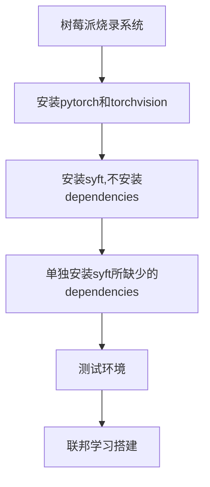

# 树莓派搭建联邦学习平台

# Record
2022/10/10：提出用两个树莓派去制作一个联邦学习的平台
2022/10/12：解决环境问题

# Experiments

## 参考实验信息
选取[联邦学习小系统搭建和测试（PySyft + Raspberry Pi 4） ](https://zhuanlan.zhihu.com/p/181733116)作为参考的demo。

这是2020年的一篇实验文章，很多东西版本都非常的老旧，如下所示。

|Harwared&Software|Information |
|--|--|
|2 Raspberry Pi 4B|4 cores arm A72, 8G RAM  |
|Raspberry Pi OS  | 32 bit |
| Python | version:3.7 |
| Pytorch | version:1.4.0 |
| Torchvision | version:0.5.0 |
|Pysyft | version:0.2.4|

实验步骤

## 具体实验-环境搭建

因为在每一个地方基本上都踩过一些坑，并且也有一些经验。就按照上述步骤一步步展开：

###  Part1 系统选择
使用的是树莓派的官方镜像源，会使用最新支持版本的Python。

在10/10当天烧录的时候，树莓派的Python版本还是3.9。

当10/11即第二天晚上烧录的时候树莓派的版本居然更新了，版本为3.11。

这里面有一个很大的麻烦，后续也会提及，就是Python版本超过了树莓派上所支持的torch和torchvision的版本（最多只到了3.10）。

目前想的是两个解决方案：

	1. 选择旧版本的树莓派镜像文件进行烧录
	2. 在树莓派上对Python进行降级

关于方案2对Python进行降级，也产生过问题：

	1. 删除python3.9，命令行输入python时，运行的python仍然为3.9
	2. 新安装的python3.7在解压以后无法使用

### Part2 torch 和 torchvision

很好的参考文章：[树莓派安装pytorch](https://zhuanlan.zhihu.com/p/446627852)

下载地址：[树莓派64位安装wheel文件合集](https://torch.kmtea.eu/whl/stable.html)

版本查看：[torch和torchvison版本匹配](https://github.com/pytorch/vision#installation)

作为我们最主要目标的pysyft的dependencies，这两个库的选择及其重要。

要做到 **python/torch/torchvison/syft**四个库的版本相对应。

目标实验的所有版本都很低，所以我使用了默认的3.9。

并且在实验中还遇到了一个问题：

	在官方的文档中torch1.11.0和torchvision0.12.0是正确匹配的；
	但是在我搭配这两个库使用的时候，import torchvison是失败的。

解决方案：

	使用torch1.11.0搭配torchvision0.10.0；
	此时两个库都能正常使用，但是不知道对后续syft有没有影响。

### Part3 syft

syft： [OpenMined/PySyft: (github.com)](https://github.com/OpenMined/PySyft)

Python查看dependencies的方式： [查看python第三方库的依赖](https://blog.csdn.net/qq_38316655/article/details/127943606?ops_request_misc=%257B%2522request%255Fid%2522%253A%2522169703879816800211543388%2522%252C%2522scm%2522%253A%252220140713.130102334.pc%255Fall.%2522%257D&request_id=169703879816800211543388&biz_id=0&utm_medium=distribute.pc_search_result.none-task-blog-2~all~first_rank_ecpm_v1~rank_v31_ecpm-4-127943606-null-null.142^v96^pc_search_result_base5&utm_term=%E5%A6%82%E4%BD%95%E6%9F%A5%E7%9C%8Bpython%E5%BA%93%E7%9A%84%E4%BE%9D%E8%B5%96%E5%85%B3%E7%B3%BB&spm=1018.2226.3001.4187)

清华大学镜像源：

	https://pypi.tuna.tsinghua.edu.cn/simple

这个可以说是非常折磨的一步。

在使用指令`pip install syft --no-dependencies `指令的时候安装有时候可能会比较慢，可以采用国内的镜像源，这样速度就会比较快。

同样也可以指定我们所需要的版本，采用以下指令：

	pip3 install syft==0.2.4 --no-dependencies

安装syft的时候出现最麻烦的问题就是

	1. 当前已有的package存在矛盾；
	2. 官方网站上没有找到每个版本所对应需要的packages或者requirements.txt。

解决方案：

	在Windows上安装不同版本的pysyft，使用pipdeptree查看其所需要的dependencies。

## 具体实验-环境搭建2

在本部分成功将环境搭建成功，成功在两块树莓派、Windows笔记本上搭建安装pysyft。

### 具体信息

|Harwared&Software|Information |
|--|--|
|2 Raspberry Pi 4B|arm A72  |
|Raspberry Pi OS  | 64 bit |
| Python | version:3.9.2 |
|Pysyft | version:0.6.0|

### Part1 树莓派
树莓派系统文件：[链接](https://pan.baidu.com/s/1ie7FfhOXxviWDajhsm63sg?pwd=97tp)

烧录软件：balenaetcher

首先，在烧录系统的时候一定要选择Python版本为3.9.2的镜像系统；最新的树莓派系统Python版本为3.11，版本过高，无法正常安装pysyft。

这里有一个小细节，就是安装完成以后新建一个`.txt`文件，将其改为`ssh`文件，这样树莓派就不需要链接显示器打开`ssh`接口了。

系统烧录完成以后，直接使用pip指令安装即可，默认安装0.6.0版本的pysyft。指令如下：

	pip install syft -i https://pypi.tuna.tsinghua.edu.cn/simple

安装完成以后进行测试：

	python -c 'import torch, syft'

如果没什么问题，那树莓派这边就万事大吉了。

### Part1.5 树莓派附加问题

更新以后的树莓派可以建立多个环境了，但是还是存在一些问题。

建立多个环境教程：[Raspberry Pi Documentation - Raspberry Pi OS](https://www.raspberrypi.com/documentation/computers/os.html#about-python-virtual-enivronments)

同样可以以不同的python版本建立环境，具体步骤如下：

下载所需版本的python：

	waget https://www.python.org/ftp/python/3.7.0/Python-3.7.0.tar.xz
	tar zxvf Python-3.9.2.tar.gz

<!--stackedit_data:
eyJoaXN0b3J5IjpbLTE4Mzk3MTM1NjYsMjA2Nzc5MjkzLC0xNz
UzODI4NTY3LC0xOTc4NDgzOTU3LDE3MjY2NzA3NDBdfQ==
-->